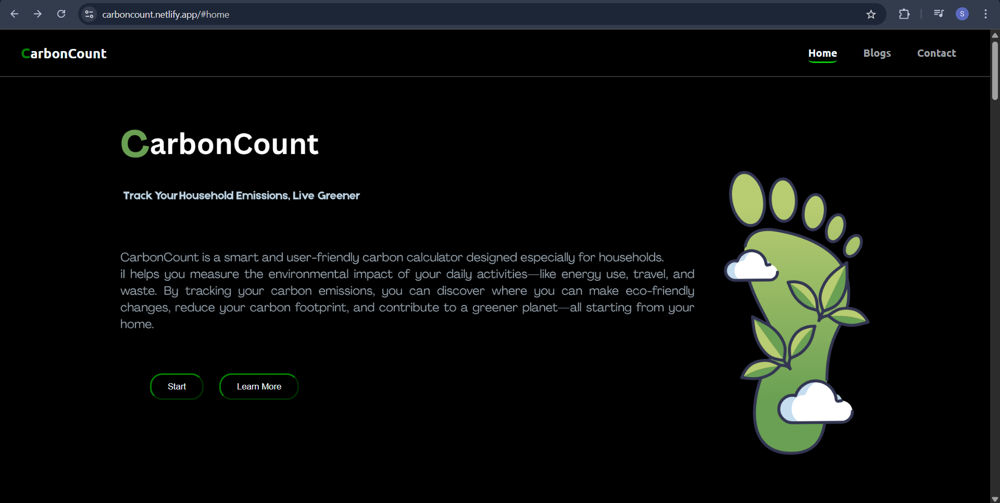
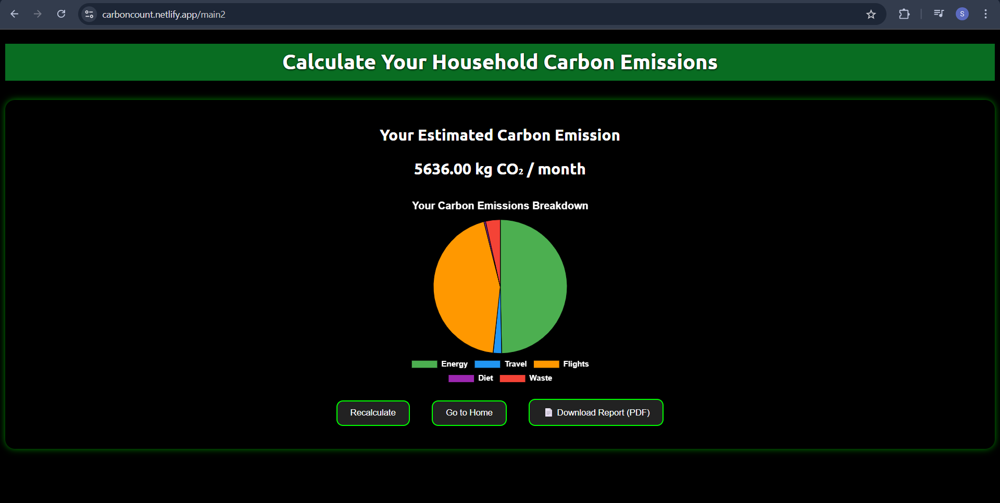

# 🌱 CarbonCount - Carbon Emission Calculator

[Live Website 🌍](https://carboncount.netlify.app/#home)

CarbonCount is a user-friendly web application designed to help households understand and track their daily carbon emissions. Built with simplicity and accessibility in mind, CarbonCount empowers users to make more eco-conscious decisions in their daily lives.

---

## 🧠 Features

- 🔢 **Carbon Emission Calculator** – Estimate your daily carbon footprint based on household habits.
- 📊 **Interactive Charts** – Visual feedback on your carbon output through dynamic graphs using Chart.js.
- 💡 **Eco Tips** – Learn simple, actionable ways to reduce your emissions.
- 📱 **Responsive Design** – Works smoothly on desktops, tablets, and mobile devices.
- 🔒 **No Login Required** – Instant access without any sign-up or personal data collection.

---

## 🚀 Tech Stack

- **Frontend:** HTML, CSS, JavaScript
- **Charts:** Chart.js + chartjs-plugin-datalabels
- **Deployment:** Netlify

---

## 👥 Developers

- **Pepakayala Sivasai** – Lead Developer, UI/UX, Core Functionality  
- **Taraksai** – Co-developer, Design Support & Collaboration

> *Note: While CarbonCount is a team project, the majority of the development was led and executed by Pepakayala Sivasai.*

---

## 📷 Screenshots

### Home Page  


### Calculator in Action  


*(Add actual images to a `/screenshots` folder in your GitHub repo)*

---

## 🛠️ Installation & Setup

If you'd like to run this project locally:

1. Clone the repository  
   ```bash
   git clone https://github.com/your-username/carboncount.git
